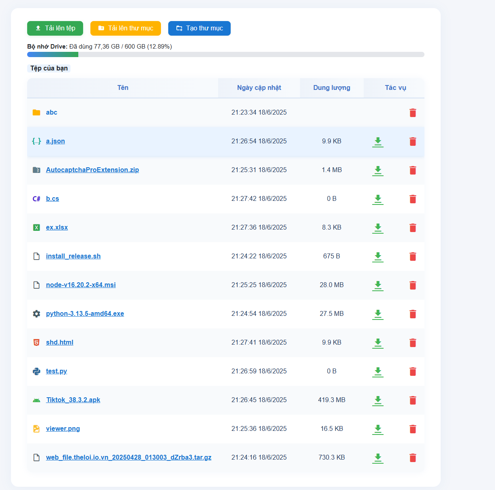

**Mini Google Drive** là một dự án giúp bạn upload, quản lý và chia sẻ file qua Google Drive với giao diện web thân thiện.

---

## 💾 Yêu cầu hệ thống

- Node.js >= 16.x
- npm hoặc yarn
- Tài khoản Google (để tạo OAuth2 Client)
- Đã bật Google Drive API (xem hướng dẫn bên dưới)

---

---

## 🚀 Hướng dẫn cài đặt

### 1. Clone dự án về máy

```bash
git clone https://github.com/lowji194/mini-google-drive.git
cd mini-google-drive
```

### 2. Cài đặt thư viện phụ thuộc

```bash
npm install express busboy googleapis
```

---

### 3. Lấy CLIENT_ID, CLIENT_SECRET, REFRESH_TOKEN

Bạn cần điền trực tiếp các giá trị này vào đầu file `server.js`:

```js
const CLIENT_ID = 'xxx.apps.googleusercontent.com';
const CLIENT_SECRET = 'xxx';
const REDIRECT_URI = 'https://developers.google.com/oauthplayground';
const REFRESH_TOKEN = 'xxx';
```

#### Cách lấy thông tin này:

**Bước 1: Tạo OAuth Client ID trên Google Cloud**  
- Truy cập [Google Cloud Console](https://console.cloud.google.com/)
- Tạo project mới (hoặc chọn project bạn muốn dùng)
- Vào **APIs & Services > Credentials**
- Nhấn **Create Credentials > OAuth client ID**
- Application type: chọn **Web application**
- Authorized redirect URIs: thêm dòng:
  ```
  https://developers.google.com/oauthplayground
  ```
- Nhấn **Create** và copy **Client ID** và **Client Secret**

**Bước 2: Bật Google Drive API**  
- Vào **APIs & Services > Library**
- Tìm **Google Drive API** > **Enable**

**Bước 3: Lấy Refresh Token**  
- Vào [OAuth 2.0 Playground](https://developers.google.com/oauthplayground/)
- Nhấn biểu tượng bánh răng (cài đặt) → chọn **Use your own OAuth credentials**
- Nhập **Client ID** và **Client Secret**
- Ở Step 1, tìm **Drive API v3** > tick:
  ```
  https://www.googleapis.com/auth/drive
  ```
- Nhấn **Authorize APIs**, đăng nhập Google, cấp quyền, quay lại playground
- Nhấn **Exchange authorization code for tokens**
- Copy **Refresh token** và điền vào `server.js`

---

### 4. Chạy dự án

```bash
node server.js
```
Truy cập vào: [http://localhost:3001](http://localhost:3001)

---

## 📁 Cấu trúc thư mục

```
mini-google-drive/
│
├── server.js         # Code Node.js backend (chứa thông tin OAuth)
├── index.html        # Giao diện web
├── styles.css        # CSS giao diện
├── README.md         # File hướng dẫn này
```

---

## 📢 Lưu ý bảo mật

- **Không chia sẻ mã nguồn chứa CLIENT_SECRET, REFRESH_TOKEN công khai!**
- Nếu bị lộ, phải đổi lại trên Google Cloud.

---

## ❤️ Đóng góp

- Pull request và các ý tưởng cải tiến luôn được chào đón!

---

## 📧 Liên hệ

- Tác giả: [github.com/lowji194](https://github.com/lowji194)
